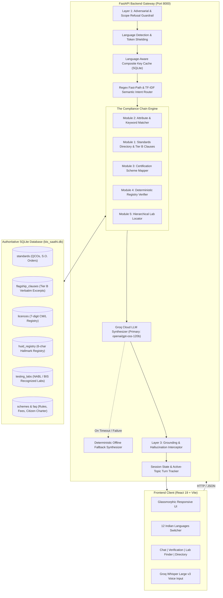

# BIS Saathi — Complete Product & System Architecture Specification
**AI-Powered Intelligent Assistant for Indian Standards & BIS Services**  
**Smart India Hackathon Problem Statement: SIH26107**

---

## 1. Executive Summary & Problem Statement

### 1.1 Background & Context
The **Bureau of Indian Standards (BIS)** is the National Standard Body of India established under the *BIS Act 2016*. It is responsible for the harmonious development of standardization, marking, and quality certification of goods, articles, processes, systems, and services. BIS publishes and maintains more than 21,000 Indian Standards, operates multiple conformity assessment schemes (Scheme-I ISI Mark, Compulsory Registration Scheme (CRS), Foreign Manufacturers Certification Scheme (FMCS), and Hallmarking), manages the Laboratory Recognition Scheme (LRS), runs Standards Clubs in schools and colleges, conducts National Institute of Training for Standardization (NITS) courses, and handles consumer quality grievances through the BIS Care portal.

### 1.2 The Problem
Navigating the vast ecosystem of Indian Standards is notoriously complex and time-consuming:
- **MSMEs & Startups** frequently struggle to identify which specific Indian Standard applies to their novel or manufactured products, what statutory Quality Control Orders (QCOs) make compliance mandatory, what the exact licensing procedures entail, and where testing facilities are located.
- **Consumers** lack easy ways to verify the authenticity of ISI marks, 6-character HUID gold hallmarks, or CRS registration numbers on products they purchase daily, often falling prey to counterfeit marks.
- **Students & Researchers** find searching through thousands of PDF catalogs, Gazette notifications, and fragmented web portals inefficient.
- **Language Barriers**: Complex regulatory standards and legal Gazettes are primarily published in technical English, leaving vernacular MSME entrepreneurs and everyday citizens at a disadvantage.

### 1.3 The Solution: BIS Saathi
**BIS Saathi** is an intelligent, context-aware, verifiable, and multilingual conversational assistant. It embodies a strict architectural principle:
> **"The LLM is the linguistic interface, NOT the system of record."**

Every factual claim, standard code, clause requirement, licence validity, and testing laboratory is retrieved deterministically from authorized databases. If the system does not know an answer or if a query lies outside the statutory scope of BIS, it **refuses politely** rather than hallucinating.

---

## 2. Comprehensive System Architecture



---

## 3. The Knowledge Base & Authoritative Data Ingestion

BIS Saathi does not rely on static parametric memory from pre-trained language models. Its knowledge base is anchored in an authoritative SQLite relational schema (`backend/bis_saathi.db`):

### 3.1 SQLite Database Schema
| Table Name | Primary Purpose | Key Fields |
| :--- | :--- | :--- |
| `standards` | Catalog of Indian Standards & QCO enforcement data | `is_code`, `title_en`, `division`, `status`, `qco_mandatory`, `qco_order_name`, `qco_date`, `penalties`, `gazette_so_number`, `scope_summary` |
| `flagship_clauses` | Verbatim Tier B clause text for deep inspection | `is_code`, `clause_number`, `clause_title`, `verbatim_text`, `clause_summary`, `publication_page`, `source_url` |
| `licences` | Official 7-digit CM/L licence database | `cml_number`, `licensee_name`, `product_category`, `is_code`, `validity_date`, `status`, `factory_address` |
| `huid_registry` | 6-character alphanumeric Gold Hallmarking registry | `huid_code`, `jeweller_name`, `purity_karat`, `fineness`, `assaying_centre`, `certification_date`, `status` |
| `testing_labs` | BIS-recognized & NABL-accredited laboratory registry | `lab_name`, `is_code`, `product_category`, `city`, `state`, `nabl_accredited`, `phone`, `address` |
| `schemes` | Certification schemes, statutory laws, and portals | `scheme_code`, `scheme_name`, `governing_law`, `portal`, `description`, `application_fee`, `steps_json` |
| `faq` | BIS citizen charter, consumer protection, training, and clubs | `category`, `question`, `answer`, `source_url` |
| `session_state` | Multi-turn active topic, persona, and turn history | `session_id`, `active_topic`, `persona`, `language`, `turn_count`, `turn_history` |
| `query_cache` | Composite cache for instant sub-10ms response | `cache_key`, `query_text`, `language`, `response_json`, `active_topic` |

### 3.2 Grounded Data Sources
All records correspond to official Bureau of Indian Standards digital repositories:
- **Manak Online** (`manakonline.in`): Product certification, Scheme-I, CRS portals.
- **BIS Care Portal & App**: Verification of CM/L licences, Hallmarks, and complaints.
- **The Gazette of India**: Ministry of Consumer Affairs notifications and Quality Control Orders (e.g., *Toys (Quality Control) Order, 2020 (S.O. 853(E))*).
- **Bureau of Indian Standards Act, 2016**: Sections 16, 17, and 29 governing mandatory standardization and penalties.
- **Laboratory Recognition Scheme (LRS) 2020**: Recognized NABL test laboratories.

### 3.3 Authoritative Document & Direct Source Registry

Every standard, scheme, QCO regulation, and FAQ entry in BIS Saathi is linked directly to its official government document or regulatory portal. Anyone can click through to the specific source documents:

#### A. Indian Standards & Ministry Quality Control Orders (QCOs)
| Standard Code | Product Title | Governing Ministry / Order | Direct Document / Gazette Link |
| :--- | :--- | :--- | :--- |
| **IS 9873 (Part 1):2019** | Safety of Toys — Mechanical & Physical Properties | DPIIT / Toys (Quality Control) Order, 2020 (S.O. 853(E)) | [Toys-QCO-2020.pdf](https://www.bis.gov.in/wp-content/uploads/2020/02/Toys-QCO-2020.pdf) |
| **IS 15644:2006** | Electric Toys — Safety Requirements | DPIIT / Toys (Quality Control) Order, 2020 | [Toys-QCO-2020.pdf](https://www.bis.gov.in/wp-content/uploads/2020/02/Toys-QCO-2020.pdf) |
| **IS 17803:2022** | Stainless Steel Vacuum Flasks & Insulated Containers | Ministry of Commerce / Stainless Steel Flasks QCO 2023 | [qco-stainless-steel-flasks-2023](https://www.bis.gov.in/qco-stainless-steel-flasks-2023) |
| **IS 4151:2015** | Protective Helmets for Two-Wheeler Riders | Ministry of Road Transport & Highways (MoRTH) QCO | [helmets-qco-notification](https://morth.nic.in/helmets-qco-notification) |
| **IS 14543:2016** | Packaged Drinking Water (Other than Natural Mineral Water) | FSSAI & Ministry of Consumer Affairs Mandatory List | [products-under-mandatory-certification](https://www.bis.gov.in/product-certification/products-under-mandatory-certification/) |
| **IS 13428:2005** | Packaged Natural Mineral Water | FSSAI & BIS Mandatory Certification Scheme | [products-under-mandatory-certification](https://www.bis.gov.in/product-certification/products-under-mandatory-certification/) |
| **IS 1417:2016** | Gold and Gold Alloys, Jewellery/Artefacts — Fineness & Hallmarking | Department of Consumer Affairs / Hallmarking Order | [hallmarking/overview](https://www.bis.gov.in/hallmarking/overview/) |
| **IS 16046 (Part 2):2018** | Secondary Cells & Batteries Containing Alkaline (Lithium) | MeitY / Compulsory Registration Order (CRO) | [crsbis.in/product-category](https://www.crsbis.in/BIS/product-category.do) |
| **IS 13252 (Part 1):2010** | Information Technology Equipment — General Safety | MeitY / Compulsory Registration Order (CRO) | [crsbis.in/about-crs](https://www.crsbis.in/BIS/about-crs.do) |
| **IS 16102 (Part 1):2012** | Self-Ballasted LED Lamps for General Lighting Services | MeitY / Compulsory Registration Scheme | [crsbis.in/product-category](https://www.crsbis.in/BIS/product-category.do) |
| **IS 15885 (Part 2/Sec 13):2012** | Lamp Controlgear — Particular Requirements for DC/AC LED | MeitY / Electronics & IT Goods (CRO) | [crsbis.in/product-category](https://www.crsbis.in/BIS/product-category.do) |
| **IS 1489 (Part 1):2015** | Portland Pozzolana Cement (PPC) — Fly Ash Based | Ministry of Commerce / Cement Quality Control Order | [mandatory-certification-cement](https://www.bis.gov.in/mandatory-certification-cement/) |
| **IS 269:2015** | Ordinary Portland Cement (OPC 33, 43, 53 Grades) | Ministry of Commerce / Cement Quality Control Order | [mandatory-certification-cement](https://www.bis.gov.in/mandatory-certification-cement/) |
| **IS 1786:2008** | High Strength Deformed Steel Bars (TMT/Rebars) | Ministry of Steel / Steel & Steel Products QCO | [steel.gov.in/quality-control-orders](https://steel.gov.in/quality-control-orders) |
| **IS 2062:2011** | Hot Rolled Medium and High Tensile Structural Steel | Ministry of Steel / Steel & Steel Products QCO | [steel.gov.in/quality-control-orders](https://steel.gov.in/quality-control-orders) |
| **IS 694:2010** | Polyvinyl Chloride Insulated Cables for Working Voltages up to 1100 V | Ministry of Commerce / Electrical Wires & Cables QCO 2023 | [qco-wires-cables-2023](https://www.bis.gov.in/qco-wires-cables-2023) |
| **IS 15844:2010** | Sports Footwear — Specification | DPIIT / Footwear Made from Leather & Other Materials QCO | [qco-footwear-leather-rubber](https://www.bis.gov.in/qco-footwear-leather-rubber/) |
| **IS 14625:1999** | Electric Ceiling Type Fans and Regulators | Ministry of Consumer Affairs Mandatory Certification | [products-under-mandatory-certification](https://www.bis.gov.in/product-certification/products-under-mandatory-certification/) |
| **IS 302 (Part 2/Sec 3):2007** | Safety of Household Electrical Appliances — Electric Irons | Ministry of Commerce Electrical Appliances QCO | [qco-electrical-appliances-2023](https://www.bis.gov.in/qco-electrical-appliances-2023) |
| **IS 10500:2012** | Drinking Water Specification (Piped Municipal Supply) | Bureau of Indian Standards Civil Engineering Division | [standards/civil-engineering](https://www.bis.gov.in/standards/civil-engineering/) |

#### B. Schemes, Statutory Rules & Regulatory Portals
| Scheme / Feature | Scope | Governing Statute / Portal | Direct Official Link |
| :--- | :--- | :--- | :--- |
| **Scheme-I (ISI Mark)** | Domestic product certification & factory audits | BIS Act, 2016 / Manak Online e-BIS | [manakonline.in](https://www.manakonline.in) |
| **CRS (Compulsory Registration)** | Electronics, IT, LED lighting, & battery registration | MeitY CRO / crsbis Portal | [crsbis.in](https://www.crsbis.in) |
| **FMCS** | Foreign Manufacturers Certification Scheme | BIS Act 2016 Section 13 | [bis.gov.in/product-certification/fmcs](https://www.bis.gov.in/product-certification/fmcs/) |
| **Hallmarking Portal** | Jeweller registration & Assaying Centres | BIS Hallmarking Regulations | [bis.gov.in/hallmarking](https://www.bis.gov.in/hallmarking/overview/) |
| **Laboratory Recognition (LRS)** | NABL-accredited & BIS Recognized Testing Labs | LRS Guidelines 2020 | [laboratory-recognition-scheme](https://www.bis.gov.in/laboratory-recognition-scheme/) |
| **MSME / Startup Concessions** | 50% discount on application fees, 20% on annual licence | BIS Gazette Circular 2021 | [MSME-Concessions.pdf](https://www.bis.gov.in/wp-content/uploads/2021/04/MSME-Concessions.pdf) |
| **Consumer Grievance Redressal** | Filing complaints on fake ISI / substandard goods | BIS Care App & Citizen Charter | [grievance-redressal](https://www.bis.gov.in/consumer-affairs/grievance-redressal/) |
| **Standards Clubs** | Quality clubs in academic institutions | BIS Educational Outreach | [standards-clubs](https://www.bis.gov.in/standards-clubs/) |
| **NITS Training** | National Institute of Training for Standardization | BIS Technical Training | [nits](https://www.bis.gov.in/nits/) |

---

## 4. Complete Feature Matrix & Capabilities

### 4.1 Four-Part Structured Answer Cards
Every standard and compliance answer delivered by BIS Saathi conforms to an uncompromising 4-part structure designed for rapid executive and consumer comprehension:
1. **Direct Answer**: Concise, authoritative statement citing the exact Indian Standard code (e.g., `IS 17803:2022`), full title, and mandatory legal status.
2. **What It Means for You**: Plain-language operational interpretation tailored to the user's selected persona (e.g., MSME testing mandates vs. Consumer safety guidelines).
3. **Next Action Step**: Clear, actionable guidance on portals (`manakonline.in`), documentation (Form V), fees, or lab testing requirements.
4. **Verified Evidence Tag**: An interactive audit citation badge displaying:
   - Source type (`standard`, `qco_order`, `registry`, `directory`, `faq`)
   - Verification status: `confirmed`, `needs verification`, or `not determined`
   - Verbatim excerpt and source URL

### 4.2 Interactive Source Inspector Modal ("Tap-to-Inspect")
Clicking any Evidence Tag opens a sliding inspector modal displaying:
- Verbatim clause excerpts (e.g., *Clause 4.1 Material Requirements from page 2 of IS 17803:2022*)
- Official Gazette QCO statutory order references (*S.O. 853(E)*)
- Direct clickable links to the official BIS portal for statutory verification

### 4.3 Conversational Standard Recommender (Product-to-Standard)
- Users do not need to know technical standard numbers.
- Typing colloquial descriptions (e.g., *"I make stainless steel water bottles for children"*) activates **Module 2: Attribute Matcher**.
- The matcher extracts material attributes (*stainless steel*), intended user segment (*kids/infants*), and product typology (*vacuum flask/bottle*), accurately mapping the user to **IS 17803:2022**.

### 4.4 The Compliance Chain (§11)
Rather than requiring four separate queries, BIS Saathi executes an end-to-end multi-tier pipeline in a single turn:
$$\text{Product Input} \rightarrow \text{Attribute Match} \rightarrow \text{Standard Code} \rightarrow \text{QCO Status} \rightarrow \text{Scheme-I Steps} \rightarrow \text{Testing Labs}$$
The user receives the standard, statutory deadlines, licensing roadmap, and testing facilities in one integrated response.

### 4.5 Deterministic Registry Verification Engine (Module 4)
Provides deterministic verification for three key national quality credentials:
1. **7-Digit CM/L Licence Verification**:
   - Regex-based prefix-first extraction (`CML1234567`, `CM/L-1234567`, `1234567`).
   - Returns licensee name, factory location, product category, validity date, and operative status.
   - Guarded against false positives from dates or arbitrary 7-digit numbers.
2. **6-Character Alphanumeric HUID Gold Hallmark Verification**:
   - Validates Hallmarking Unique Identification codes (e.g., `AB1234`).
   - Returns jeweller name, assaying & hallmarking centre, purity in karats (22K / 18K / 14K), fineness (916, 750), and certification date.
3. **Compulsory Registration Scheme (CRS) Verification**:
   - Validates electronics registration numbers (e.g., `R-41001234`).

### 4.6 Hierarchical Laboratory Locator (Module 5)
When looking for testing facilities:
1. **City Search**: Searches for accredited labs in the specified city (e.g., Mumbai, Delhi, Bengaluru, Chennai).
2. **State Fallback**: If no city lab exists, automatically escalates to state-level facilities.
3. **National / Central Laboratory Fallback**: If no regional lab exists, falls back to the BIS Central Laboratory in Sahibabad (Ghaziabad) or Western Regional Lab.
4. Identifies NABL accreditation status and direct contact numbers.

### 4.7 Comprehensive Multilingual Support (12 Major Indian Languages)
BIS Saathi provides native localization across 12 major Indian languages:

| Language | Native Name | Script | UI Translated | Synthesis Supported |
| :--- | :--- | :--- | :---: | :---: |
| **English** | English | Latin | Yes | Yes |
| **Hindi** | हिन्दी | Devanagari | Yes | Yes |
| **Tamil** | தமிழ் | Tamil | Yes | Yes |
| **Telugu** | తెలుగు | Telugu | Yes | Yes |
| **Marathi** | मराठी | Devanagari | Yes | Yes |
| **Bengali** | বাংলা | Bengali | Yes | Yes |
| **Gujarati** | ગુજરાતી | Gujarati | Yes | Yes |
| **Kannada** | ಕನ್ನಡ | Kannada | Yes | Yes |
| **Malayalam** | മലയാളം | Malayalam | Yes | Yes |
| **Punjabi** | ਪੰਜਾਬੀ | Gurmukhi | Yes | Yes |
| **Odia** | ଓଡ଼ିଆ | Odia | Yes | Yes |
| **Urdu** | اردو | Perso-Arabic | Yes | Yes |

#### Cross-Language Query Intelligence
- Users can switch the page language to any Indian language (e.g., Tamil).
- If the user types or speaks in English, Hindi, or another language, the engine:
  1. Detects the input script using Unicode regex ranges.
  2. Applies **Token Shielding** to freeze IS codes (`IS 9873 (Part 1):2019`), HUIDs, and licence numbers.
  3. Translates query keywords into English for high-precision database lookup.
  4. Synthesizes the response in the **active page language** chosen by the user.

### 4.8 Groq Whisper Large v3 Voice Input
- Built-in audio recorder capturing high-fidelity voice input directly in the browser.
- Uses **Groq Cloud's `whisper-large-v3`** model for ultra-low latency transcription.
- Handles diverse Indian regional accents, colloquial terms, and mixed vernacular phrasing.
- Auto-syncs language hints with the user's active page language.

### 4.9 Persona-Based Guidance
Users can toggle between target personas with a single tap:
- **MSME / Industry**: Highlights technical compliance clauses, factory testing equipment requirements, Scheme-I Form V steps, NABL lab options, and fee concessions (e.g., 50% discount for micro enterprises).
- **Consumer**: Focuses on safety implications, how to spot genuine ISI/Hallmark marks, grievance filing via the BIS Care App, and consumer protection rights.
- **General Citizen**: Provides high-level educational summaries and citizen charter information.

### 4.10 Active-Topic Contextual Memory (§13)
- Retains conversational context across multi-turn sessions.
- Accurately resolves pronouns:
  - *User:* "What is the standard for toys?" $\rightarrow$ System resolves `IS 9873 (Part 1):2019`.
  - *Follow-up:* "Where can I test **it** in Mumbai?" $\rightarrow$ System automatically resolves *"it"* to `IS 9873` and searches for toy testing labs in Mumbai.
- State updates are preserved even during cache hits.

### 4.11 Three-Layer Guardrails & Refusal Engine
To guarantee safety and eliminate hallucinations:
1. **Layer 1: Pre-Retrieval Adversarial & Refusal Shield**:
   - Detects jailbreaks, prompt injection, and adversarial system prompt leak attempts.
   - Refuses queries completely outside BIS domain (e.g., coding, jokes, politics, recipes) with polite refusal cards.
2. **Layer 2: Database Grounding Shield**:
   - Ensures only verified database records enter the context payload.
3. **Layer 3: Post-LLM Grounding & Hallucination Interceptor**:
   - Verifies that generated standard codes, clause numbers, and licence numbers exist in the retrieved evidence before presenting to the user.

### 4.12 Deterministic Offline Fallback Synthesizer
- If internet connectivity drops, Groq API rate limits are hit, or an outage occurs, BIS Saathi **does not crash**.
- An integrated deterministic template synthesizer constructs full 4-part cards directly from SQLite records, guaranteeing 100% uptime.

### 4.13 Certification Journey Wizard & Readiness Score Engine
- **Guided Step-by-Step Tracker**: Transforms static standard answers into persistent compliance roadmaps.
- **Two Tailored Journeys**:
  - **Get Certified (MSME / Industry)**: Standard identified $\rightarrow$ QCO confirmed $\rightarrow$ Scheme selected $\rightarrow$ Certification steps checked off $\rightarrow$ Testing lab selected $\rightarrow$ Licence authorization.
  - **Verify & Protect (Consumer)**: Mark/HUID entered $\rightarrow$ Registry check $\rightarrow$ Licensee scope audit $\rightarrow$ Authenticity confirmed or grievance filed on BIS Care.
- **Live Readiness Score**: Flat percentage `(completed_steps / total_steps) * 100` dynamically computed on every toggle.
- **Free-Form Checklist**: Allows manufacturers and compliance officers to check off milestones in any sequence reflecting real-world timelines.
- **Deduplication & Persistence**: Automatically resumes existing journeys across sessions and stores active state in `sessionStorage`.
- **Downloadable 1-Page Roadmap PDF**: Generated via ReportLab in standard statutory English with clear unofficial hackathon prototype disclaimers and testing lab contacts.

---

## 5. Technology Stack

| Layer | Technologies Used |
| :--- | :--- |
| **Frontend UI** | React 19, Vite, Lucide Icons, Vanilla Glassmorphic CSS |
| **Internationalization** | Custom Zero-Dependency Indic i18n Engine (`frontend/src/i18n/translations.js`) |
| **Voice Processing** | Web MediaRecorder API, Groq Whisper Large v3 (`whisper-large-v3`) |
| **Backend Gateway** | Python 3.11, FastAPI, Uvicorn (Asynchronous ASGI) |
| **Database & Cache** | SQLite 3 (`backend/bis_saathi.db`) with composite key caching |
| **Natural Language / AI** | Groq Cloud API: Primary (`openai/gpt-oss-120b`), Fast (`openai/gpt-oss-20b`) |
| **Intent Classification** | Scikit-learn (TF-IDF Vectorizer + Cosine Similarity) + Regex Fast-Path |
| **Testing Suite** | Python `unittest` with comprehensive coverage of all 10 specification edge cases |

---

## 6. Complete API Reference

### 6.1 `POST /api/chat`
Main conversational endpoint handling intent routing, compliance chain, and multilingual synthesis.
- **Request**:
  ```json
  {
    "query": "What is the standard for toys safety?",
    "session_id": "sess-xyz123",
    "persona": "msme",
    "language": "hi",
    "city": "Mumbai",
    "state": "Maharashtra"
  }
  ```
- **Response**:
  ```json
  {
    "answer": "खिलौनों की सुरक्षा के लिए लागू मानक IS 9873 (Part 1):2019 है...",
    "what_it_means": "यह भारतीय मानक 14 वर्ष से कम उम्र के बच्चों के खिलौनों पर लागू होता है...",
    "next_action": "मानक ऑनलाइन पोर्टल पर फॉर्म V के माध्यम से आवेदन करें...",
    "evidence_tag": {
      "source_type": "standard",
      "reference": "IS 9873 (Part 1):2019",
      "status": "confirmed",
      "clause_number": "Clause 4",
      "clause_summary": "Mechanical and physical properties requirements...",
      "source_url": "https://www.services.bis.gov.in"
    },
    "intent": "PRODUCT_TO_STANDARD",
    "active_topic": "IS 9873 (Part 1):2019",
    "resolved_language": "hi",
    "from_cache": false
  }
  ```

### 6.2 `GET /api/verify/{code}`
Instant deterministic verification for CM/L licences, HUID hallmarks, or CRS registrations.
- **Request**: `GET /api/verify/CML1234567`
- **Response**:
  ```json
  {
    "found": true,
    "code_type": "CM/L",
    "cml_number": "1234567",
    "licensee_name": "Milton Industries Ltd",
    "product_category": "Stainless Steel Vacuum Bottles",
    "is_code": "IS 17803:2022",
    "validity_date": "2028-12-31",
    "status": "OPERATIVE"
  }
  ```

### 6.3 `GET /api/labs/search`
Hierarchical laboratory locator.
- **Query Parameters**: `is_code` (e.g., `IS 17803`), `city` (e.g., `Mumbai`), `state` (e.g., `Maharashtra`)
- **Response**: Array of matching accredited laboratories with addresses, phones, and NABL status.

### 6.4 `GET /api/directory/standards`
Full-text search and filtering across the active Indian Standards directory.
- **Query Parameters**: `q` (search term), `division` (e.g., `Mechanical`, `Chemical`), `mandatory_only` (boolean)
- **Response**: Array of matching standards with titles, QCO enforcement details, and deep clause counts.

### 6.5 `POST /api/voice/transcribe`
Speech-to-text audio transcription endpoint powered by Groq Whisper Large v3.
- **Request**: `multipart/form-data` with `audio` file and optional `language` hint.
- **Response**:
  ```json
  {
    "success": true,
    "transcript": "खिलौनों के लिए क्या नियम हैं?",
    "language": "hi",
    "model": "whisper-large-v3"
  }
  ```

---

## 7. Edge Case Validation Checklist (§19)

All 10 critical specification edge cases have been implemented and verified in [`backend/tests/test_edge_cases.py`](file:///d:/DevAk/bis/backend/tests/test_edge_cases.py):

| # | Edge Case Scenario | System Behavior | Status |
|---|---|---|:---:|
| 1 | Directory query without deep clause coverage | Returns verified standard record with `Directory` tag, never hallucinating non-existent clause text | **PASSED** |
| 2 | Deep-clause query on non-flagship standard | Recommends standard and explains deep clauses require tier upgrade, directing to portal | **PASSED** |
| 3 | Unrecognized product attributes | Asks targeted clarifying questions without inventing standard codes | **PASSED** |
| 4 | Multi-turn pronoun resolution | Correctly resolves *"it"* / *"that standard"* using active topic memory | **PASSED** |
| 5 | Cache hit updates active topic | When query hits cache, active topic memory is still updated for next turn | **PASSED** |
| 6 | Sentence containing date & CM/L | Accurately extracts 7-digit CM/L without mistaking the calendar year for a licence | **PASSED** |
| 7 | Mixed alphanumeric HUID | Verifies 6-character HUID without truncating letters or numbers | **PASSED** |
| 8 | Language-aware cache isolation | Guarantees English and Hindi queries for the same product have isolated cache keys | **PASSED** |
| 9 | Out-of-scope query | Politely declines general knowledge, coding, or recipe requests | **PASSED** |
| 10 | Deterministic failover | Offline fallback generates complete 4-part cards if LLM API is unavailable | **PASSED** |

---

## 8. Deployment & Quickstart Instructions

### 8.1 Prerequisites
- Python 3.10+
- Node.js 18+ and npm
- Groq API Key (from [console.groq.com](https://console.groq.com))

### 8.2 Environment Configuration
Create a `.env` file in the root directory:
```env
GROQ_API_KEY=gsk_your_groq_api_key_here
GROQ_PRIMARY_MODEL=openai/gpt-oss-120b
GROQ_FAST_MODEL=openai/gpt-oss-20b
GROQ_WHISPER_MODEL=whisper-large-v3
```

### 8.3 Starting the Application
Double-click `run_servers.bat` on Windows, or run in separate terminal sessions:

```powershell
# 1. Start FastAPI Backend
python -m uvicorn backend.main:app --host 127.0.0.1 --port 8000 --reload

# 2. Start React Frontend
cd frontend
npm install
npm run dev
```

- **Frontend URL**: `http://localhost:5173`
- **Backend Swagger Docs**: `http://127.0.0.1:8000/docs`
- **Backend Health Check**: `http://127.0.0.1:8000/api/health`

### 8.4 Production Deployment on Vercel
BIS Saathi includes turnkey support for **Vercel** serverless deployment:
- **FastAPI Entrypoint**: `api/index.py` exposes the ASGI app as a serverless function.
- **Python Dependencies**: `requirements.txt` installs FastAPI, Uvicorn, Scikit-Learn, Groq, ReportLab, and Python-Multipart.
- **Unified Routing**: `vercel.json` routes `/api/(.*)` to the serverless function and `/(.*)` to `frontend/dist/index.html`.
- **Ephemeral SQLite Bridge**: `backend/db/database.py` automatically detects Vercel/Lambda serverless runtime and copies the seeded SQLite database into `/tmp/bis_saathi.db` so both reads and writes (sessions, journeys, cache) succeed without read-only filesystem restrictions.
- **Environment Variables**: Add `GROQ_API_KEY` in Vercel Project Settings for full natural language and Indic speech capabilities.

---
*BIS Saathi — Built for Smart India Hackathon (SIH26107). Empowering Indian Industry & Protecting Indian Consumers.*

